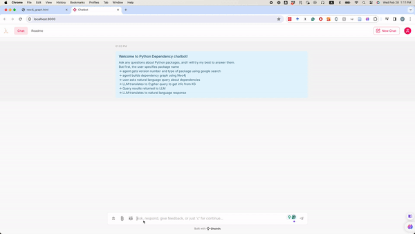

<div align="center">
  
</div>


# DepsRAG

`DepsRAG` is a chatbot that answers user's questions about software dependency knowledge graphs. `DepsRAG` offers the following features:
- Constructing the software dependencies (direct and transitive) as knolwedge graphs
- Supporting 4 popular software ecosystems (i.e. PyPI, NPM, Cargo, and Go). 
- Generatiing atutomatically Cypher queries to retrieve information from the KG.
- Augmenting users' questions with the retrieved information.

The workflow of `DepsRAG` as follows: 
- The chatbot will ask you to provide the name and ecosystem of the software package.
- It will then the tool `GoogleSearchTool` to get the version of this package (you can skip this process by providing the intended version).
- The chatbot will ask to confirm the version number before proceeding with constructing the dependencies as knowledge graph.
-  Finally, after constructing the dependency graph, you can ask the chatbot
questions about the dependency graph such as these (specific package names are
used here for illustration purposes, but of course you can use other names):

   - what's the depth of the graph?
   - what are the direct dependencies?
   - any dependency on pytorch? which version?
   - Is this package pytorch vunlnerable?
  (Note that in this case the chatbot will consult the 
  tool `GoogleSearchTool` to get an answer from the internet.)
   - tell me 3 interesting things about this package or dependency graph
   - what's the path between package-1 and package-2? (provide names of package-1
  and -2)
   - Tell me the names of all packages in the dependency graph that use pytorch.


# :fire: Updates/Releases

<details>
<summary> <b>Click to expand</b></summary>

- **May 2024:** 
  - Adding integration with [OSV](https://osv.dev/) vulnerability database to search for 
  vulnerabilities

- **April 2024:**
   - Supporting the construction of dependency graph for Go, Cargo, and NPM.

- **March 2024:**
   - Supporting Chainlit to run DepsRAG via UI

- **Feb 2024:**
   - Adding tool to visualize the dependency graph

</details>

## Requirements:

This example relies on the `neo4j` Database. The easiest way to get access to neo4j is
by creating a cloud account at [Neo4j Aura](https://neo4j.com/cloud/platform/aura-graph-database/). OR you
can use Neo4j Docker image using this command:

```bash
docker run --rm \
    --name neo4j \
    -p 7474:7474 -p 7687:7687 \
    -e NEO4J_AUTH=neo4j/password \
    neo4j:latest
```

Upon creating the account successfully, neo4j will create a text file contains
account settings, please provide the following information (uri, username,
password, and database), while creating the constructor `Neo4jChatAgentConfig`. 
These settings can be set inside the `.env` file as shown in [`.env-template`](.env-template)


## Architecture of DepsRAG

This example uses a `DependencyGraphAgent` 
(derived from [`Neo4jChatAgent`](https://github.com/langroid/langroid/blob/main/langroid/agent/special/neo4j/neo4j_chat_agent.py)).
It auto-generates a `neo4j` knowledge-graph based on the dependency
structure of a given `PyPi` package. You can then ask the chatbot questions
about the dependency graph. This agent uses two tools in addition to those 
already available to `Neo4jChatAgent`:

- DepGraphTool to build the dependency graph for a given pkg version, using the API
   at [DepsDev](https://deps.dev/)
- GoogleSearchTool to find package version and type information. It also can answer
other question from the web about other aspects after obtaining the intended information
from the dependency graph. For examples:
  - Is this package/version vulnerable?
  - does the dpendency use latest version for this package verion?
  - Can I upgrade this package in the dependency graph?

The `Neo4jChatAgent` has access to these tools/function-calls:

- `GraphSchemaTool`: get schema of Neo4j knowledge-graph
- `CypherRetrievalTool`: generate cypher queries to get information from
   Neo4j knowledge-graph (Cypher is the query language for Neo4j)
- `VulnerabilityCheck`: search OSV vulnerability DB based on package name, version, and 
its ecosystem.
- `VisualizeGraph`: visualize the dependency grpah

### Running the example

Run like this:
```
python3 dependencyrag/dependency_chatbot.py
```

Here is a recording shows the example in action:


Run the UI version like this:
```
chainlit run dependencyrag/chainlit/chainlit_dependency_chatbot.py
```

Here is a recording shows the example in action:


**NOTE:** the dependency graph is constructed based
on [DepsDev API](https://deps.dev/). Therefore, the Chatbot will not be able to
construct the dependency graph if this API doesn't provide dependency metadata
infromation. 

# DepsRAG Paper Citation

You can find the paper that describes the details of DepsRAG [HERE](https://arxiv.org/abs/2405.20455)

```
@misc{alhanahnah2024depsrag,
      title={DepsRAG: Towards Managing Software Dependencies using Large Language Models}, 
      author={Mohannad Alhanahnah and Yazan Boshmaf and Benoit Baudry},
      year={2024},
      eprint={2405.20455},
      archivePrefix={arXiv},
      primaryClass={cs.SE}
}
```

